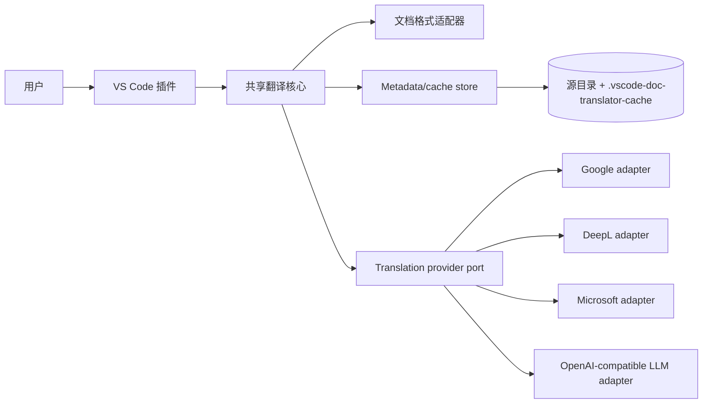
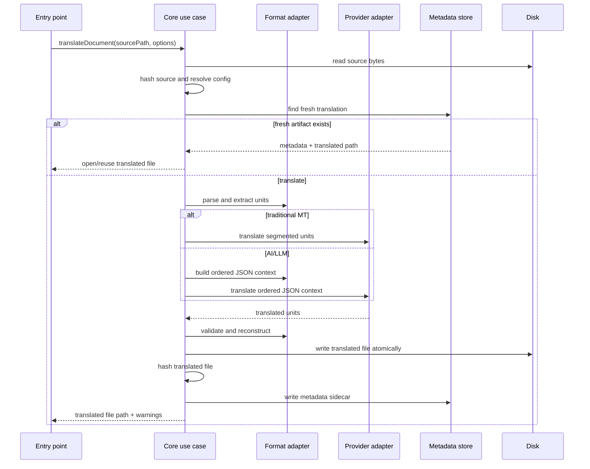

# 架构概览

最后更新：2026-07-14
状态：实现中

## 系统目的

VSCode Doc Translator 通过 VS Code 插件翻译整份文本类文档。系统用格式适配器保护文档结构，用 provider 适配器接入不同翻译服务，并在源文件同目录的 `.vscode-doc-translator-cache/` 中保存可校验的 metadata sidecar。

核心目标是：源文件不被覆盖，译文文件可直接打开，metadata 能判断源文件和译文是否仍然匹配，provider 不直接渲染最终文件。

## 高层图



## 当前模块边界

| 路径 | 职责 |
| --- | --- |
| `src/core/domain/` | 类型契约、hash、命名、protected token、term lock 基础规则。 |
| `src/core/formats/` | Plain text、Markdown、MDX、HTML/XML 格式适配器。负责抽取 translation units 和重建最终文档。 |
| `src/core/providers/` | Provider factory、OpenAI-compatible/DeepL/Google/Microsoft provider、HTTP retry、传统 provider batching、AI 分段、LLM JSON 恢复和缺失 id 补请求。 |
| `src/core/application/` | `translateDocument` use case、metadata/cache store、文件读取和原子写入。 |
| `src/extension/` | VS Code 命令、右键菜单入口、SecretStorage、设置 webview、diff preview、状态栏任务状态。 |
| `tests/` | 命名、metadata、格式适配器、provider contract、AI chunking 和 provider factory 测试。 |

依赖方向保持为 VS Code extension 调用 shared core；core 依赖 domain contracts、format adapters 和 provider adapters；provider 外部 API 细节不能泄漏到格式重建或 metadata store。

## 核心契约

### Document format adapter

```ts
interface DocumentFormatAdapter {
  readonly id: string;
  readonly version: string;
  canHandle(file: SourceFileInfo): boolean;
  parse(input: ParseInput): Promise<ParsedDocument>;
  extractUnits(document: ParsedDocument): Promise<TranslationUnit[]>;
  buildOrderedJsonContext?(
    document: ParsedDocument,
    units: TranslationUnit[],
    request: {
      readonly documentId: string;
      readonly sourceLanguage: string | "auto";
      readonly targetLanguage: string;
    }
  ): Promise<OrderedDocumentContext>;
  reconstruct(document: ParsedDocument, translations: TranslationMap): Promise<ReconstructedDocument>;
  validate?(document: ParsedDocument, translations: TranslationMap): Promise<ValidationIssue[]>;
}
```

格式适配器拥有语法保真责任。它决定哪些文本可以翻译、哪些结构必须保护。AI/LLM 可以获得格式适配器生成的 ordered JSON context，但最终文件重建仍由 `reconstruct` 完成。

### Ordered document context

```ts
interface OrderedDocumentContext {
  readonly documentId: string;
  readonly sourceLanguage: string | "auto";
  readonly targetLanguage: string;
  readonly format: string;
  readonly units: OrderedContextUnit[];
}

interface OrderedContextUnit {
  readonly id: string;
  readonly order: number;
  readonly kind: "paragraph" | "heading" | "listItem" | "tableCell" | "text";
  readonly sourceText: string;
  readonly protectedTokens: ProtectedToken[];
  readonly nearbyContext?: string;
}
```

`OrderedDocumentContext` 是 AI/LLM 的参考输入结构，不是最终输出格式，也不是 cache schema。LLM 必须返回扁平 JSON 译文列表，不能直接输出 Markdown、HTML 或纯文本成品。

### Output directory mode

```ts
type OutputDirectoryMode = "same-dir" | "hidden-cache";
```

输出位置由 core use case 统一处理：

- `same-dir`：默认模式，译文文件写在源文件旁边。
- `hidden-cache`：译文文件写进源文件同目录下的 `.vscode-doc-translator-cache/`。

Metadata 的 `target.relativePath` 始终从源文件目录计算；hidden-cache 模式下它会包含隐藏目录名。缓存命中必须同时匹配 source hash、目标语言、provider、输出模式和译文 hash。

### Translation provider

```ts
type TranslationRequestPackaging = "segmented-units" | "ordered-json-context";

interface ProviderCapabilities {
  readonly requestPackaging: TranslationRequestPackaging;
  readonly maxBatchCharacters?: number;
  readonly maxContextCharacters?: number;
  readonly maxContextTokens?: number;
  readonly maxOutputTokens?: number;
  readonly supportsStructuredJsonOutput: boolean;
  readonly supportsGlossary?: boolean;
}

interface TranslationProvider {
  readonly id: string;
  readonly displayName: string;
  readonly capabilities: ProviderCapabilities;
  translateBatch(request: TranslateRequest): Promise<TranslateResult>;
}
```

传统机器翻译 provider 使用 `segmented-units`。OpenAI-compatible LLM provider 使用 `ordered-json-context`，并要求结构化 JSON 输出。

## AI/LLM 分段算法

OpenAI-compatible provider 根据模型上下文和单次输出预算构造请求：

1. `maxContextTokens` 表示模型最大上下文窗口。
2. `maxOutputTokens` 表示单次响应最大输出 token，并作为 API `max_tokens` 发送。
3. 可用输入预算近似为 `maxContextTokens - maxOutputTokens - promptOverheadTokens`。
4. Provider 按原文顺序选择连续目标 units，目标范围同时受预计输出 token 和最小输入 payload token 限制。
5. 确定目标范围后，provider 用剩余输入预算扩展 `referenceDocument.units`。参考窗口必须包含目标 units，并尽量向目标范围前后扩展，给模型最大可用上下文。
6. 请求中的 `translationUnitIds` 是本次真正要求模型翻译的 id。模型只能返回这些 id 的译文，不能翻译参考窗口里的其他 id。
7. 多个请求返回的 `{ id, text }[]` 合并后交给核心流程校验，再由格式适配器重建最终文档。

兼容项：旧的 `maxContextCharacters` 仍可传入，provider 会按 `charactersPerToken` 近似换算成 token 预算。新配置和设置面板应优先使用 `maxContextTokens` 与 `maxOutputTokens`。

AI 请求 payload 形态：

```json
{
  "sourceLanguage": "auto",
  "targetLanguage": "zh-CN",
  "referenceDocument": {
    "documentId": "doc:sha256:...",
    "sourceLanguage": "auto",
    "targetLanguage": "zh-CN",
    "format": "markdown",
    "units": []
  },
  "translationUnitIds": ["unit-1", "unit-2"],
  "outputSchema": {
    "translations": [
      {
        "id": "one id from translationUnitIds",
        "text": "translated text preserving protected tokens",
        "skip": "optional true only when the source text should remain unchanged"
      }
    ]
  }
}
```

OpenAI-compatible provider 会要求模型对 `translationUnitIds` 中的每个 id 都返回一条记录。正常翻译使用 `{ "id": "...", "text": "..." }`；当模型判断某个 unit 应保持原文时，必须返回 `{ "id": "...", "skip": true }`，而不是省略该 id。Provider 会自动解析被 Markdown code fence 或说明文字包裹的 JSON，并在第一次响应缺少 id 时，对缺失的 unit 发起一次补请求。

## 数据流



## VS Code 状态栏

VS Code extension 在激活时创建 `TranslationStatusBar`。状态栏项位于右侧，负责显示：

- idle：无任务运行，点击打开设置；
- running：翻译任务运行中，显示阶段进度和百分比；
- cached：命中缓存，点击打开最近译文；
- success：翻译成功，点击打开最近译文；
- failed：翻译失败，显示错误状态，点击打开设置。

Core use case 通过可选 `onProgress` 回调报告阶段事件。当前阶段包括 cache 检查、解析、准备分段、调用 provider、校验、写入、缓存命中和完成。VS Code extension 使用该回调更新通知和状态栏，core 本身不依赖 VS Code UI。

## 关键不变量

- 源文档永远不被覆盖。
- 可见译文文件名必须包含 `auto`、目标语言和 UTC 时间戳。
- Metadata 默认写入 `.vscode-doc-translator-cache/`。
- `hidden-cache` 输出模式下，译文文件也写入 `.vscode-doc-translator-cache/`，但仍由 metadata 的 target hash 校验。
- 一个 metadata sidecar 只指向一个译文 artifact。
- 新鲜度判断基于 hash，不基于 mtime。
- 当前译文 hash 与 metadata 不一致时，视为用户已编辑，不能静默覆盖。
- Provider secrets 不进入 metadata、日志或测试 fixture。
- Provider 只能返回 unit-level 译文，不能拥有最终文件渲染权。
- VS Code 插件必须通过 core use case 执行翻译，不把 provider、格式重建或 cache 规则写进 UI 层。

## 验证策略

| 区域 | 检查 |
| --- | --- |
| 命名和 metadata | path generation、hash prefix、schema、source stale、edited output。 |
| Markdown 保真 | parse、extract、测试 provider 翻译、reconstruct、protected token 和结构检查。 |
| Plain text 保真 | 段落、空行、换行风格、BOM 剥离。 |
| Phase 2 格式 | MDX 结构保护、HTML/XML text-node 翻译。 |
| Provider adapters | Mock HTTP contract tests；真实 API 测试必须显式凭据启用。 |
| LLM structured output | ordered JSON context、missing id、duplicate id、invalid JSON、protected token 校验。 |
| AI large files | token 预算分段、目标 id 与参考窗口分离、`max_tokens` 传递、结果合并。 |
| Term locks | 用户配置术语在 provider round trip 中保持不翻译。 |
| VS Code 插件 | 命令注册、右键菜单贡献、设置 webview 和 SecretStorage smoke。 |

## 已知风险

- Google、DeepL、Microsoft provider 已有适配器，但仍需要真实凭据 live 验证。
- OpenAI-compatible provider 依赖服务兼容 JSON mode 和 `max_tokens` 语义；不同网关可能有差异。
- Markdown/MDX adapter 当前是语法感知第一版，不是完整 AST/MDX parser；复杂文档还需要 fixture 扩展。
- 单个超长 unit 可能同时超过输入或输出预算；当前会单独请求并记录 warning，后续需要更细粒度拆分。
- 取消、恢复、segment-level cache 和进度细分仍未完成。

## 参考

- 产品设计：`docs/design.md`
- ADR：`docs/adr/2026-07-13-shared-core-and-sidecar-cache.md`
- ADR：`docs/adr/2026-07-14-ai-sliding-reference-context.md`
